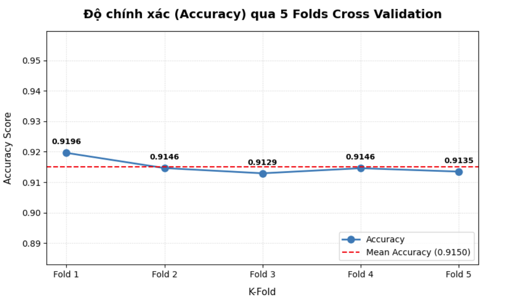
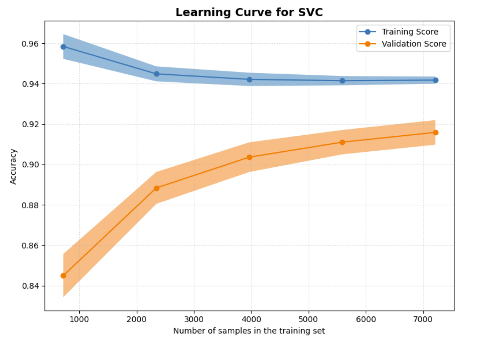
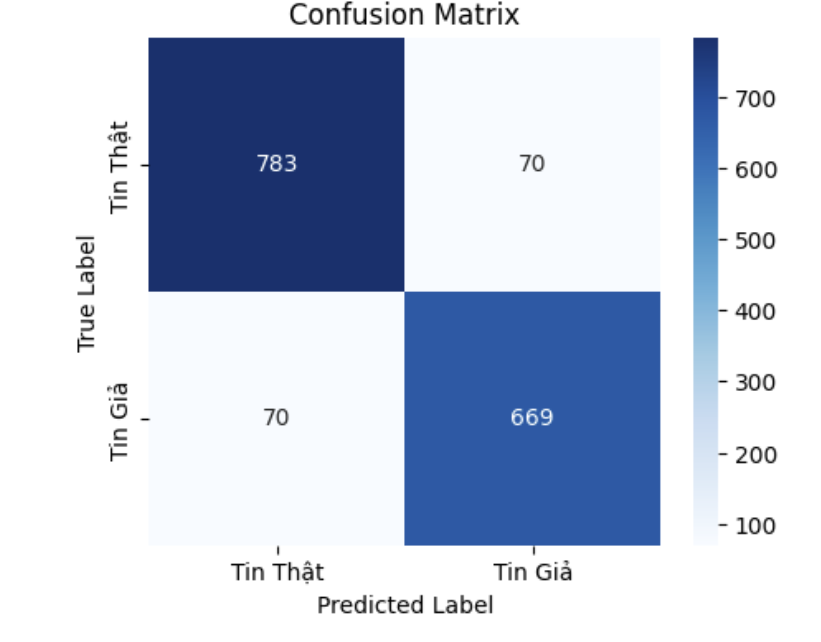

# XÂY DỰNG HỆ THỐNG PHÂN LOẠI TIN GIẢ VỀ Y TẾ VÀ SỨC KHỎE TRÊN CÁC TỜ BÁO ĐIỆN TỬ DỰA TRÊN KỸ THUẬT TF-IDF KẾT HỢP THUẬT TOÁN SUPPORT VECTOR MACHINE

## 1. Giới thiệu

Dự án xây dựng mô hình phát hiện tin giả tiếng Việt sử dụng phương pháp học máy truyền thống với:

* Tiền xử lý văn bản tiếng Việt.
* Tokenization bằng `PyVi`.
* Biểu diễn văn bản bằng TF-IDF.
* Phân loại bằng Support Vector Machine (SVM).
* Đánh giá mô hình bằng Accuracy, Precision, Recall, F1-score, Confusion Matrix và K-Fold Cross Validation.

---
# 2. Yêu cầu môi trường

Dự án được phát triển trên:

```
Python >= 3.10
```

# 3. Cài đặt môi trường

## Sử dụng pip

Clone repository:

```bash
git clone https://github.com/nguyencongviet-sv/FakeNewDetections_YTeSucKhoe.git
```

Di chuyển vào thư mục dự án:

```bash
cd FakeNewDetections_YTeSucKhoe
```

Cài đặt thư viện:

```bash
pip install -r requirements.txt
```

---
# 4. Dataset


Dataset được sử dụng trong dự án:

Vietnamese Medical Fake News Dataset

Nguồn:
https://www.kaggle.com/datasets/leviettrieu369/vietnamese-medical-fake-news-dataset


Dataset chứa các bài viết y tế tiếng Việt được gán nhãn nhằm phục vụ bài toán phát hiện tin giả.
# 5. Hướng dẫn cài đặt chương trình
> * **Bước 1:** Clone project [FakeNewDetections_YTeSucKhoe](https://github.com/nguyencongviet-sv/FakeNewDetections_YTeSucKhoe)
> * **Bước 2:** Cài đặt tất cả thư viện từ requirements.txt.
> * **Bước 3:** Tải tập dữ liệu Dataset từ Kaggle, sau đó lưu vào dataset với tên YTe.csv.
> * **Bước 4:** Tiến hành chạy file src/main.py
# 6. Kết quả 
## K_Fold 

## Learning Cure 

## Đánh giá trên tập kiểm thử 

